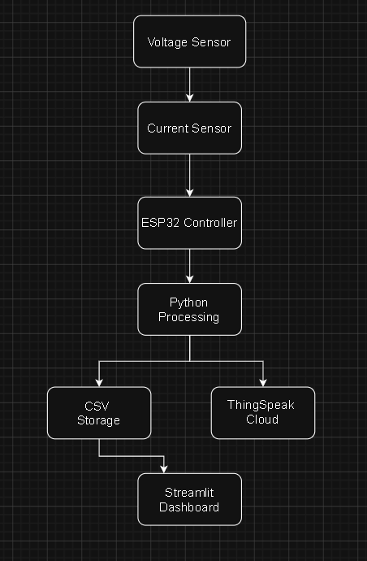
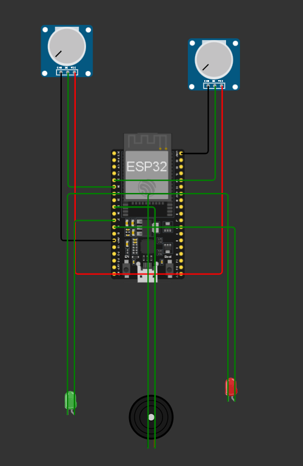
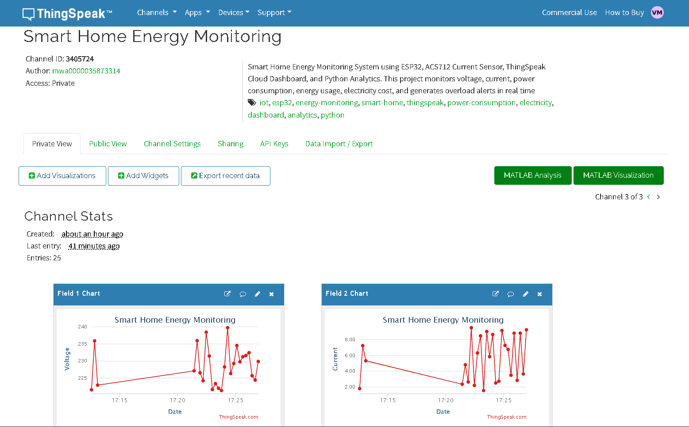
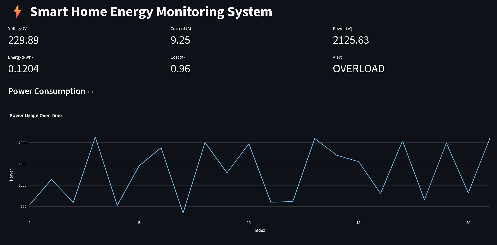
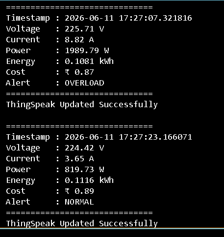
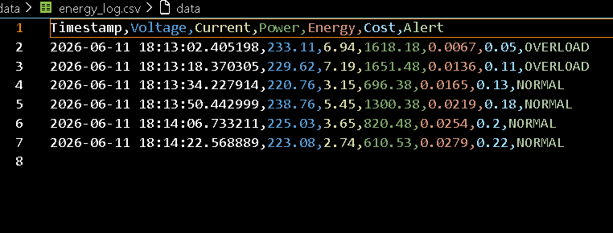

# ⚡ Smart Home Energy Monitoring System

An IoT-based Smart Home Energy Monitoring System developed using **ESP32**, **Python**, **ThingSpeak**, **Streamlit**, and **Wokwi Simulation**. This project monitors voltage, current, power consumption, energy usage, electricity cost, and overload conditions in real time while providing cloud-based visualization and analytics.

---

## 🚀 Live Demo

### Streamlit Dashboard
https://smart-home-energy-monitoring-system-takt8syreoh6x5rprychym.streamlit.app/

### GitHub Repository
https://github.com/Vayu-143/Smart-Home-Energy-Monitoring-System

---

## 📌 Project Overview

The Smart Home Energy Monitoring System is designed to simulate and monitor household electricity usage. The system collects electrical parameters, calculates power and energy consumption, estimates electricity cost, detects overload conditions, stores data locally, and uploads data to ThingSpeak for cloud visualization.

The project combines:

- IoT Monitoring
- Cloud Analytics
- Data Logging
- Dashboard Visualization
- Alert Generation
- ESP32 Simulation

---

## ✨ Features

### Electrical Monitoring
- Real-time Voltage Monitoring
- Real-time Current Monitoring
- Power Consumption Calculation
- Energy Usage Tracking

### Cost Analysis
- Electricity Cost Estimation
- Configurable Tariff Rate

### Alert System
- Overload Detection
- Visual Alert Indicators
- Cloud-Based Alert Monitoring

### Data Management
- CSV Data Logging
- Historical Data Storage
- Cloud Data Upload

### Visualization
- Streamlit Dashboard
- ThingSpeak Charts
- Interactive Analytics

---

## 🛠 Technologies Used

| Technology | Purpose |
|------------|----------|
| ESP32 | IoT Controller |
| Python | Data Processing |
| Streamlit | Dashboard |
| ThingSpeak | Cloud Analytics |
| Wokwi | Circuit Simulation |
| CSV | Data Logging |
| GitHub | Version Control |

---

# System Architecture

The Smart Home Energy Monitoring System collects voltage and current data from sensors (simulated using Wokwi), processes the readings using ESP32 and Python, stores data locally in CSV format, uploads real-time metrics to ThingSpeak Cloud, and visualizes energy consumption through a Streamlit dashboard.



### Workflow

Voltage Sensor
↓
Current Sensor
↓
ESP32 Controller
↓
Power & Energy Calculation
↓
CSV Logging
↓
ThingSpeak Cloud
↓
Streamlit Dashboard
↓
Overload Alert Detection

---

## 📂 Project Structure

```text
Smart-Home-Energy-Monitoring-System
│
├── arduino_code/
│   └── esp32_energy_monitor.ino
│
├── circuit_diagram/
│
├── dashboard/
│   └── app.py
│
├── data/
│   └── energy_log.csv
│
├── docs/
│   ├── architecture.md
│   └── thingspeak_setup.md
│
├── images/
│
├── outputs/
│   ├── charts/
│   └── reports/
│
├── python_simulation/
│   └── report_generator.py
│
├── main.py
├── requirements.txt
├── README.md
└── .gitignore
```

---

## 📊 Parameters Monitored

| Parameter | Description |
|------------|------------|
| Voltage (V) | Supply Voltage |
| Current (A) | Load Current |
| Power (W) | Voltage × Current |
| Energy (kWh) | Accumulated Energy Usage |
| Cost (₹) | Electricity Cost |
| Alert | Overload Detection |

---

## ☁️ ThingSpeak Integration

The system uploads data to ThingSpeak every 15 seconds.

### Fields Used

| Field | Parameter |
|---------|----------|
| Field 1 | Voltage |
| Field 2 | Current |
| Field 3 | Power |
| Field 4 | Energy |
| Field 5 | Cost |
| Field 6 | Alert Status |

### Alert Logic

| Value | Status |
|---------|---------|
| 0 | NORMAL |
| 1 | OVERLOAD |

---

## 📈 Streamlit Dashboard Features

- Live Voltage Monitoring
- Live Current Monitoring
- Real-Time Power Display
- Energy Consumption Trends
- Cost Analysis
- Alert Visualization
- Historical Data Charts
- Raw Data Table

---

## 🔔 Overload Detection

The system continuously checks power consumption.

```python
if power > 1500:
    alert = "OVERLOAD"
else:
    alert = "NORMAL"
```

Whenever power exceeds the threshold, the alert system is activated and uploaded to ThingSpeak.

---

## 🔌 Wokwi Simulation

Hardware simulation was performed using Wokwi.

Components Used:

- ESP32 Dev Module
- Potentiometer (Voltage Simulation)
- Potentiometer (Current Simulation)
- LED Indicators
- Buzzer

Simulation allows testing without physical hardware.

---

# Project Screenshots

## Wokwi Circuit Simulation



---

## ThingSpeak Dashboard



---

## Streamlit Dashboard



---

## Terminal Output



---

## CSV Log



---

## System Architecture


---

## 📋 Installation

### Clone Repository

```bash
git clone https://github.com/Vayu-143/Smart-Home-Energy-Monitoring-System.git
```

### Navigate to Project

```bash
cd Smart-Home-Energy-Monitoring-System
```

### Install Dependencies

```bash
pip install -r requirements.txt
```

### Run Data Generator

```bash
python main.py
```

### Run Dashboard

```bash
streamlit run dashboard/app.py
```

---

## 📄 Future Enhancements

- MQTT Integration
- Mobile Application
- AI-Based Energy Forecasting
- Smart Meter Integration
- Email Notifications
- SMS Alerts
- Home Automation Integration

---

## 👨‍💻 Author

### Vayunandan Mishra

IoT Developer | Python Developer | Electronics Enthusiast

GitHub:
https://github.com/Vayu-143

---

## ⭐ Project Highlights

✔ Real-Time Energy Monitoring

✔ ThingSpeak Cloud Integration

✔ Streamlit Interactive Dashboard

✔ ESP32 Simulation Using Wokwi

✔ Overload Alert System

✔ CSV Data Logging

✔ Cost Estimation

✔ IoT + Cloud + Analytics Integration

---

## 📜 License

This project is developed for educational and research purposes.

© 2026 Vayunandan Mishra